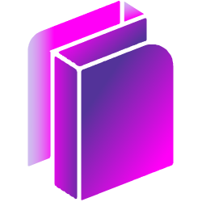

 

 

# 다변량 시계열 분석 어플리케이션

[econox.io](https://www.econox.io/) | [서비스 소개](https://www.econox.wiki/ko/tutorial)

미래를 예측하려면 다변량 시계열이 필수입니다.  
한 회사의 주가를 예측하려면 그 주가 뿐 아니라 금융 시장 전체의 상호작용을 파악해야 합니다.

확률이 아닌 논리를 기반으로 금융 시장을 이해하려는 사람들부터  
AI 모델 개발에 필요한 금융 데이터를 찾고 있는 사람들까지

부분이 아닌 전체를 보고 직접 이해해 보세요.
다변량 시계열 분석 어플리케이션 Econox입니다!

### 기술 스택

- Backend: FastAPI - Python
- Frontend: Svelte - Typescript
- Infra: AWS
  - Computing: ECS
  - Data: EFS, RDS, ElastiCache(Redis)

### 개요

프로젝트 기간: 2023년 4월 ~ 2023년 6월  
참여 인원: [원정후](https://github.com/clomia) - 개인 프로젝트

### 관련 컨텐츠

- [2024.3.21 일기](https://www.clomia.com/3614f0b3-e1f5-4943-b996-398c1bb68303)

---

이 프로젝트에 대한 질문이나 제안은 clomia.sig@gmail.com 으로 메일 보내주세요.  
편하게 연락 주시면 빠르게 확인 후 당일 회신드리겠습니다.
